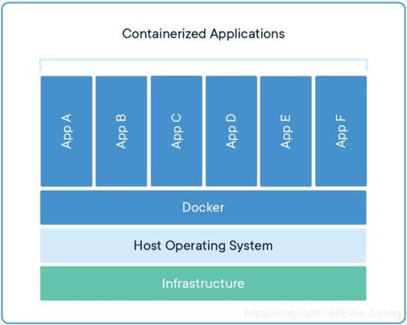

容器：一个"单进程"模型

Docker核心技术：namespace和cgroup

`docker run -it busybos /bin/bash`

为何进入容器内执行ps能看到PID=1的进程？

容器通过
`int pid = clone(main_function, stack_size, CLONE_NEWPID|SIGCHLD, NULL);`

新创建的进程会'看到'一个全新的进程空间，但其实在宿主机的进程空间里，这个进程的pid还是真实的数值。即通过namespace机制实现了docker进程之间的隔离。

这里docker应该放在与APP同一水平位置，因为容器里的应用进程其实仍由宿主机操作系统统一管理，只是这些被隔离的进程有额外设置过的namespace参数。

2。 既然所有容器共用底层的资源，那么就得做好资源隔离。linux control group（linux cgroups）

cgroups给用户暴露的操作接口是文件系统。比如cpu在/sys/fs/cgroup/cpu。通过修改文件内容进行资源限制。

`echo 20000 > /sys/fs/cgroup/cpu/container/cpu.cfs_quota_us`

`echo 226 > /sys/fs/cgroup/cpu/container/tasks`
