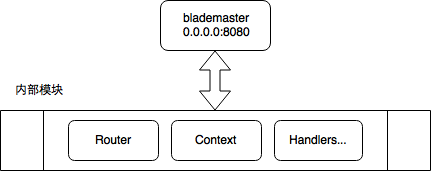
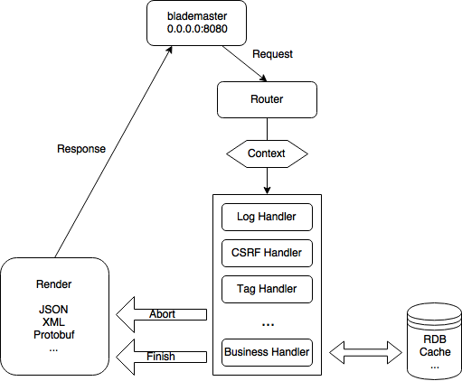

github: https://github.com/go-kratos/kratos

HTTP Blademaster: 基于gin进行模块化设计

Rounter用于根据请求的路径分发请求,Context包含一个完整的请求信息（可用作超时控制），Handler则负责处理传入的Context，Handlers是一个列表，串行执行。

业务逻辑作为最后一个handler。串行执行的handler可以中断整个处理请求。一般用于校验登陆的middleware中：一旦发现请求不合法，直接响应拒绝。

BM核心Context

https://github.com/go-kratos/kratos/blob/master/doc/wiki-cn/blademaster-mod.md

bm的自适应限流

采样服务的cpu使用率、请求成功的qps和请求的rt

https://github.com/go-kratos/kratos/blob/master/doc/wiki-cn/ratelimit.md

