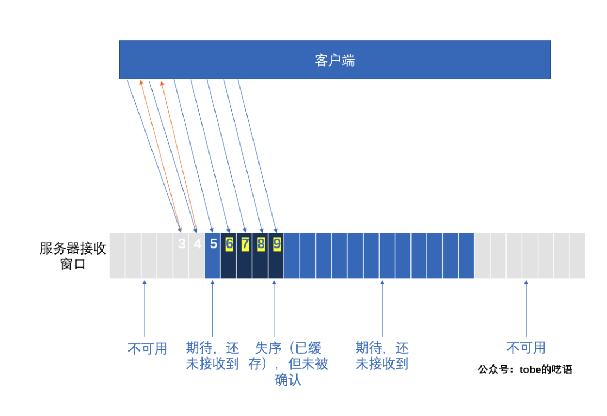
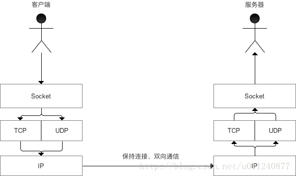

## TCP协议
TCP协议"四元组"：（src ip, dst ip, src port, dst port）

SEQ：序列号，表示每次传输中字节的偏移量

ACK：确认号，指出下一个期望接收的SEQ(接受完毕)

SYN: 同步序列号

三次握手：初始化Sequence Number的初始值。双方一来一回，四次握手，但server将回复的ACK与SYN合在一个报文中。

四次挥手：

四次挥手是释放TCP连接的握手过程。

1. 客户端向服务端发送释放连接报文FIN,等待服务端确认，并停止发送数据。

2. 服务器收到连接释放请求后，发送ACK包表示确认。

3. 服务器将最后的数据发送完毕后,就向客户端发送连接释放报文FIN，等待客户端确认。

4. 客户端接收到FIN后，发送ACK包。此时客户端进入TIME_WAIT状态，该状态将持续2MSL时间。若该时间段没有服务器重发请求的话，就进入关闭状态，当服务端接收到ACK应答后，立即进入关闭状态.

PS：为什么需要TIME_WAIT？

2*MSL确保有足够的时间让被动方接收到了ACK或主动方收到被动方发超时重传的FIN。被动方没收到第四步的ACK，触发被动方重传FIN，发送ACK+接收FIN正好2个MSL。

大规模出现TIME_WAIT，怎么办？

·容易出现在高并发短连接的场景中，网上大多建议打开两个参数tcp_tw_reuse和tcp_tw_recycle

不建议通过修改参数破坏协议来逃避TIME_WAIT，TIME_WAIT始终出现在主动发起挥手的一方，势必要牺牲资源维护从TIME_WAIT状态到CLOSED状态的连接，不如优化好业务（改用长连接）。

TCP的重传机制

·TCP协议通过重传机制保证所有的segment都可以到达对端，通过滑动窗口允许一定程度的乱序和丢包。

超时重传机制

TCP的流量控制、拥塞控制

什么是流量控制？流量控制的目的？

发送者发送数据过快，接收者来不及接收

参考文章：

https://monkeysayhi.github.io/2018/03/07/%E6%B5%85%E8%B0%88TCP%EF%BC%881%EF%BC%89%EF%BC%9A%E7%8A%B6%E6%80%81%E6%9C%BA%E4%B8%8E%E9%87%8D%E4%BC%A0%E6%9C%BA%E5%88%B6/

## UDP协议
UDP协议是面向无连接的，不需要在正式传递数据之前先连接起双方，具有不可靠性：不保证有序且不丢失的将数据传递到对端，并且没有任何控制流量的算法。

PS: 用UDP协议通讯时如何得知目标是否获得了数据包

仿造TCP做法，每发一个UDP包，都在里面加一个SEQ序号，接收方收到包后，将SEQ序号回复给发送发。如果指定时间内没有收到，说明包丢了。

### Socket
TCP或者UDP的报文，除了数据本身还包含了包的信息，比如目的地址和端口，包的源地址和端口，以及其他附加校验信息。在传输的过程中由于包长度有限需要进行拆包，然后到达目的地后进行重组。如果有丢失或者损坏的包还需要进行重传。

这些复杂且与业务无关的操作，Socket为我们封装了这些处理工作。

Socket的基本操作:

1. 连接远程机器

2. 发送数据

3. 接收数据

4. 关闭连接

5. 绑定端口

6. 监听到达数据

7. 在绑定的端口上接受来自远程机器的连接