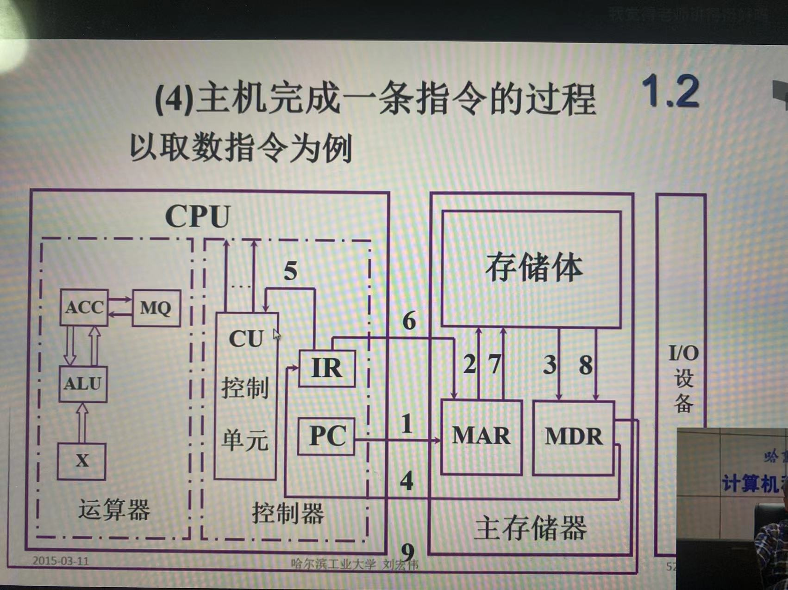

冯·诺伊曼计算机的特点:
1. 计算机由五大部件组成
2. 指令和数据以同等地位存于存储器，可按地址寻访
3. 指令和数据用二进制表示
4. 指令由操作码（取数、存数）和地址码组成
5. 存储程序（*核心）
6. 以运算器为中心

存储器的基本组成：
1. 存储体(M) - 存储单元（存放一串二进制代码，按地址进行寻址） - 存储元件
2. MAR(存储器地址寄存器)，反映存储单元的个数
3. MDR(存储器数据寄存器)，反映存储字长

运算器的基本组成：
1. 比如，累加器：两个寄存器（ACC、X），ACL（算术逻辑单元），MQ（存储计算结果）

控制器的基本结构：
1. 控制器的功能？

    解释指令、保证指令的按序执行
2. 控制器的基本组成
    完成一条指令：取指令(PC:程序计数器，存放当前欲执行指令的地址)、分析指令(IR：指令寄存器存放当前欲执行的指令)、执行指令(CU：控制单元)
    
