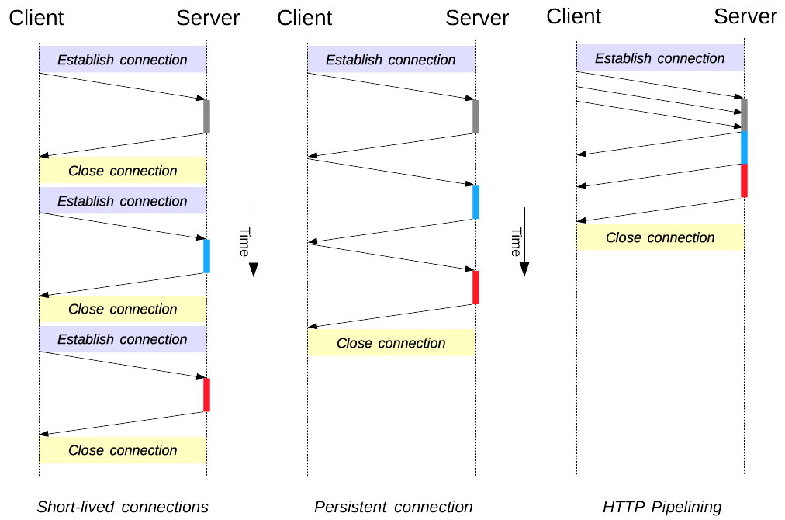
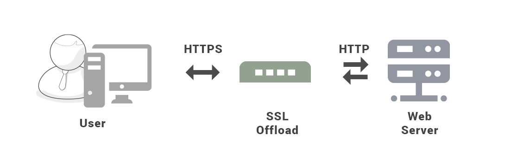
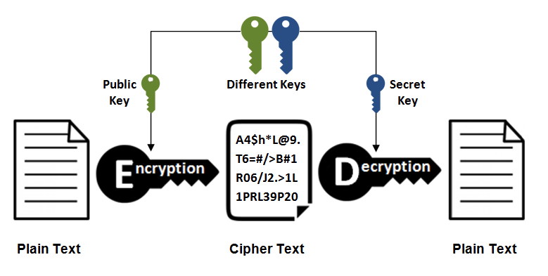

**URI**

URI包括URL(统一资源定位符，https://www.google.com)和URN(统一资源名称, urn:isbn:0451450523)

请求报文和响应报文：

1. 请求报文：

2. 响应报文：

**HTTP方法**

客户端发送的请求报文第一行为请求行，包含了方法字段

GET：获取资源

POST：传输实体主体

HEAD：获取报文首部

TRACE：追踪路径

**HTTP状态码**

1XX 信息性状态码，接受的请求正在处理

100 Continue：表明到目前为止都很正常，客户端可以继续发送请求或忽略这个响应。

2XX：成功

3XX：重定向

4XX：客户端错误

400 Bad Request：请求报文中存在语法错误

401 Unauthorized:需要认证信息(BASIC认证、DIGEST认证)

403 Forbidden

5XX：服务器错误

**连接管理**

长连接和短连接

HTTP/1.1开始默认长连接

流水线

默认情况下，HTTP下一个请求只有在当前请求收到响应后才会被发出。流水线是在同一个长连接上连续发出请求，而不用等待响应返回，这样可以减少延迟。

**Cookie**

HTTP的无状态性。Cookie是服务器发送到用户浏览器并保存在本地的一小块数据，他会在游览器之后向同一服务器再次发起请求时被携带上，用于告知服务端两个请求是否来自同一浏览器。

创建过程

服务器发送的响应报文包含Set-Cookie首部字段，客户端得到响应报文后把Cookie内容保存到游览器。

Set-Cookie: yummy_cookie=choco

Set-Cookie: tasty_cookie=strawberry

客户端之后对同一个服务器发送请求时，会从游览器中取出Cookie信息并通过Cookie请求首部字段发送给服务器。

**Session**

Session存储用户信息在服务端，Session可以存储在服务器上的文件、数据库或者内存中。

使用Session维护用户登录状态的过程如下：

· 用户进行登录时，用户提交包含用户名和密码的表单，放入HTTP请求报文中；

· 服务器验证该用户名和密码，如果正确则把用户信息存储到redis，他在redis中的key叫做session id；

· 服务器返回的响应报文的Set-Cookie首部字段包含这个session id，客户端收到响应报文后将该cookie值存入游览器中；

· 客户端之后对同一个服务器进行请求时包含这个Cookie值。

通信数据转发

1.代理

代理服务器接受客户端的请求，并且转发给服务器。

使用代理的主要目的是：

· 缓存 · 负载均衡 · 网络访问控制 · 访问日志记录

代理服务器分为正向代理和反向代理

· 用户察觉得到正向代理的存在。

· 而反向代理一般位于内部网络中，用户察觉不到。

2. 网关

与代理服务器不同，网关服务器会将HTTP转化为其他协议进行通信，从而请求其他非HTTP服务器的服务。

3. 隧道

使用SSL等加密手段，在客户端和服务器之间建立一条安全的通信线路。

**HTTPS**

**加密**

1. 对称密钥加密(加密和解密使用同一密钥)

2. 非对称加密

又名公开密钥加密，加密和解密使用不同的密钥

3. HTTPS采用的加密方式

对称加密传输效率高，但是无法安全的将密钥传输给通信方。HTTPS采用混合的加密机制：

· 使用非对称密钥加密方式，传输对称密钥加密方式所需要的secret key，从而保证安全性；

· 获取到secret后，再使用对称加密方式进行通信，从而保证效率。

https://github.com/CyC2018/CS-Notes/blob/master/notes/HTTP.md

4. REST API
a). URI:资源的规范
b). Request:通过标准HTTP方法对资源crud
    GET、POST、PUT、DELETE
c). 安全性和幂等性
    安全性：不会改变资源状态
    幂等性：执行1次和执行n次，对资源状态改变的效果等价
